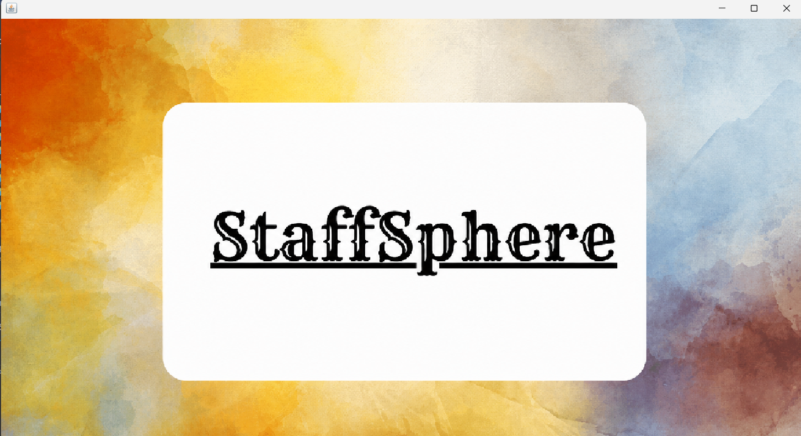
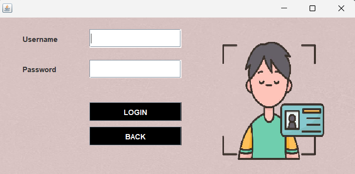
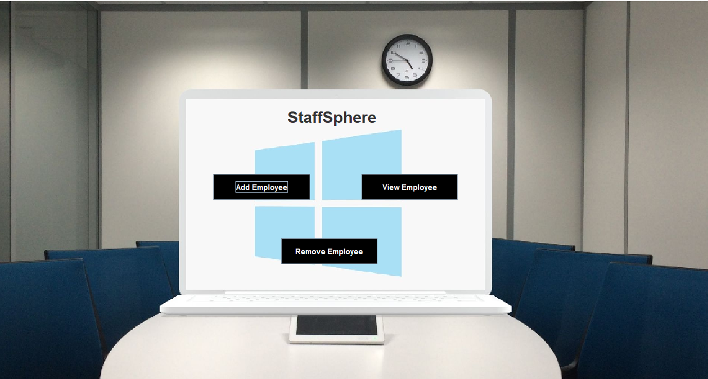
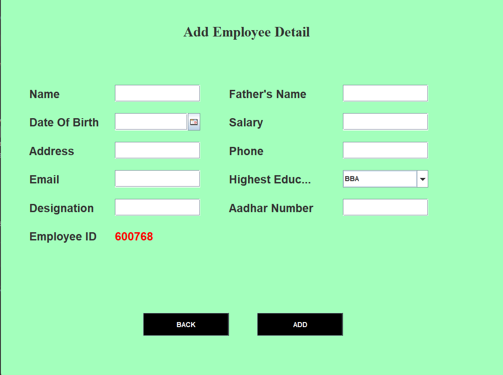
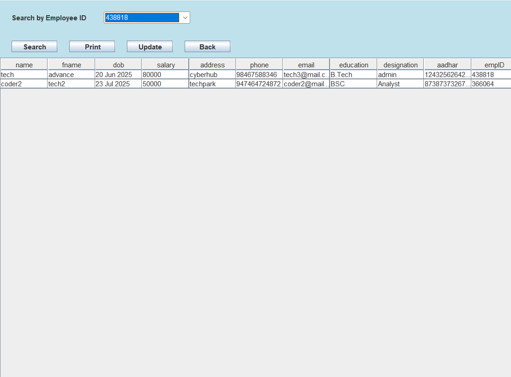
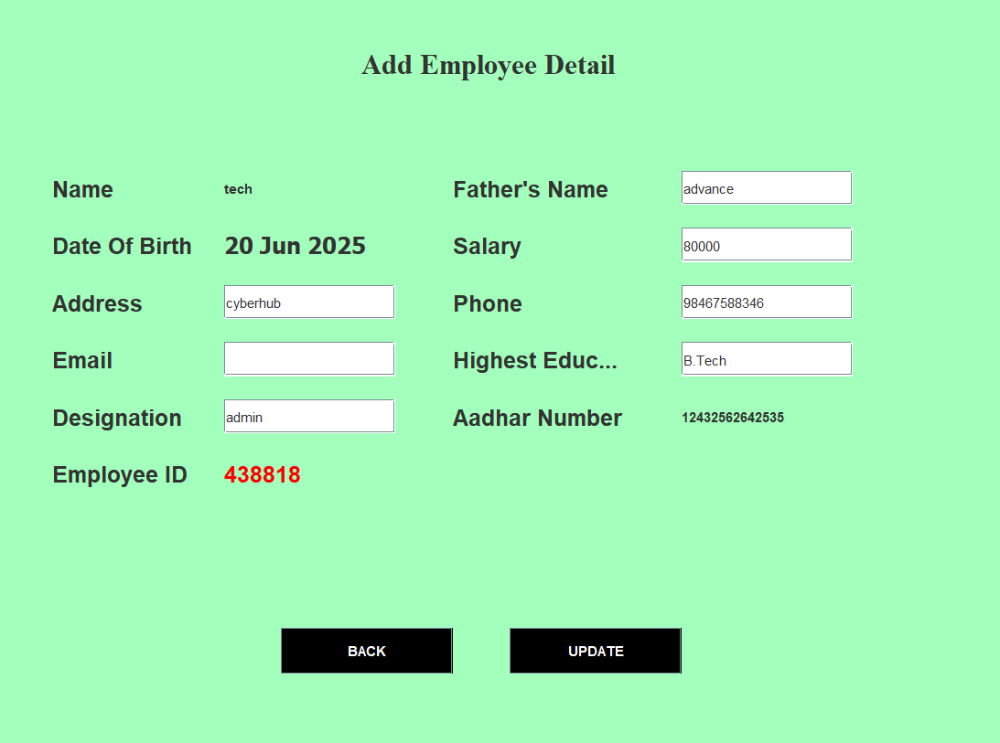
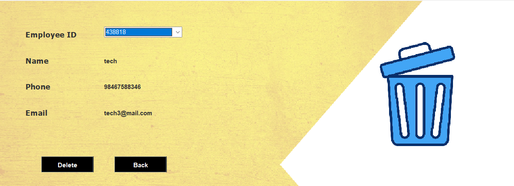

# Staff Sphere

A desktop-based **Employee Management System** developed using **Java Swing, AWT, JDBC, and MySQL**. The application provides an Admin-based interface to securely manage employee information stored in a MySQL database.

## 🚀 Features

- **Admin Login** – Admin authentication using credentials stored in the MySQL database.
- **Add Employee** – Add new employee details such as name, father's name, date of birth, salary, address, phone, email, education, designation, and Aadhaar number.
- **View Employee** – View, Search and Print employee records using Employee ID.
- **Update Employee** – Update existing employee information.
- **Remove Employee** – Delete employee records when an employee leaves the organization.
- **MySQL Database** – Store and manage employee information using MySQL and JDBC.

## 🛠️ Technologies Used

* **Java**
* **Java Swing** – Graphical User Interface
* **AWT** – GUI components, layouts, fonts, colors, and event handling
* **JDBC** – Java-MySQL database connectivity
* **MySQL** – Database management
* **IntelliJ IDEA / Eclipse** – Development environment

## 📂 Project Structure

```text
StaffSphere/
│
├── icons/
│
├── system/
│   ├── AddEmployee.java
│   ├── Login.java
│   ├── Main_class.java
│   ├── RemoveEmployee.java
│   ├── Splash.java
│   ├── UpdateEmployee.java
│   ├── View_Employee.java
│   └── conn.java
│
│
├── icons/
│   └── *.png
│
├── database/
│   └── employee_management.sql
│
└── README.md
```

              Admin Login
                   │
                   ▼
          Validate Credentials
                   │
             ┌─────┴─────┐
             │           │
           Valid       Invalid
             │           │
             ▼           ▼
        Dashboard    Error Message
             │
             ▼
    Employee Management
             │
    ┌────────┼────────┐
    ▼        ▼        ▼
   Add      View    Search
    │        │        │
    └────────┼────────┘
             │
        Update / Delete
             │
             ▼
          MySQL
```

## 📸 Screenshots


### Splash Screen


### Admin Login


### Dashboard


### Add Employee


### View Employee


### Update Employee


### Remove Employee



* GitHub: [Your GitHub Profile](https://github.com/your-username)
* LinkedIn: [Your LinkedIn Profile](https://www.linkedin.com/in/your-profile/)

## 📄 License

This project is created for **educational and portfolio purposes**.
